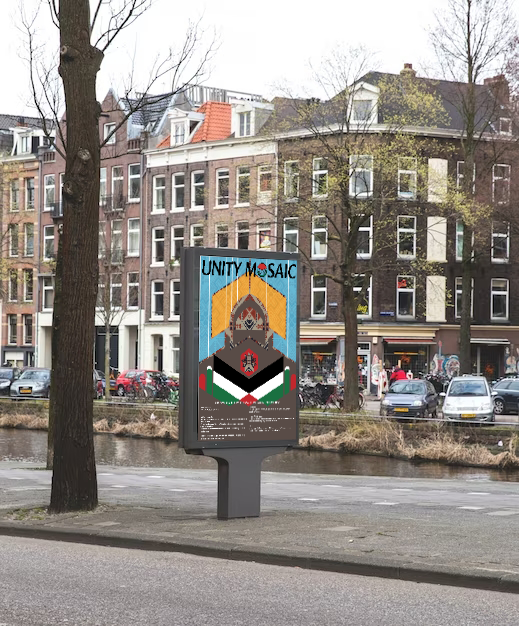

The Unity Mosaic Festival is scheduled to occur in Golden Gate Park, San Francisco, promoting and aiming to support Palestinian culture as we address the issues that still plague them today. This is scheduled for a weekend (May 17 - May 19); and is intended for a broad audience that includes advocates for global social justice, Middle Easterners, and humanitarian activists. The event shows the value of foreign assistance in fostering survival and justice in war-torn regions, such as Palestine, where CARE has provided significant support. We note that CARE has greatly helped Palestine especially when it comes to emergency relief, health services provision, and economic empowerment in the area so affected by long-term warfare.

Throughout the weekend, guests of various ages (0-50+ years) will attend several events targeted at expanding their understanding of Palestine-related topics. In addition to engaging in conversations with filmmakers and activists, attendees will view documentaries that outline the historical and contemporary struggles faced by the Palestinian people. The shows will also feature commentators on Middle East politics and CARE volunteers who will examine the resiliency of these communities. There will be workshops about art and expression, during which attendees will have a chance to learn traditional Palestinian crafts, offering a hands-on experience of the culture. The goal of these events is to foster solidarity amongst individuals from all backgrounds, including scientists, Middle Easterners themselves, and humanitarian workers.

This festival is more than just a cultural event.  It is also meant to collect funds and gather backing for CARE’s present operations in Palestine.  In order to achieve appropriate contact, the festival is purposefully being hosted in a location that is easily accessible to a big number of people. The Unity Mosaic Festival is a representation of how, in the face of war and expulsion, people and customs struggle for basic human rights/needs and dignity. Attendees can contribute to the continuation and expansion of CARE's vital work, which will guarantee that community support and solidarity can endure.

# Project Overview

The Unity Mosaic Festival, aiming to support and educate the world about the Palestinian centers, is an important event for both culture and the welfare of the people. To make it more accessible and open, the event has been scheduled for a public park. It begins with a vibrant cultural fair that features a variety of food, handicrafts, and music, all of which promote the history of and information about Palestinians.

# Wireframe

# "Physical Asset"

# Technical Overview

- HTML: For structuring the web content.
- CSS: For styling the web pages.
- Adobe Illustrator & Figma: For creating and managing design assets.
    - https://www.adobe.com/products/illustrator.html
    - https://www.figma.com/
- Visual Studio Code
    - https://code.visualstudio.com/
# Acknowledgment

- CARE.org: For their significant contributions and support to the Palestinian communities.
    - https://www.care.org/
- GitHub: For hosting and version control of project code.
    - https://github.com/XGR04/regala_festivalConcept.git
- Adobe Illustrator: For graphic design work. (Logo + Title + Merch)
- Figma: UX/UI design and wireframes.
- Visual Studio Code
